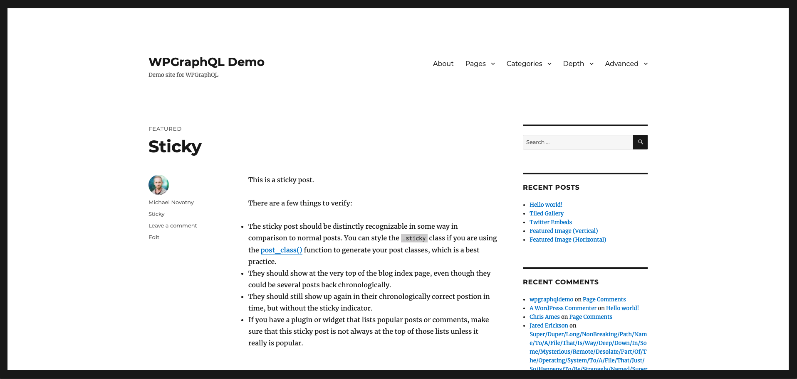
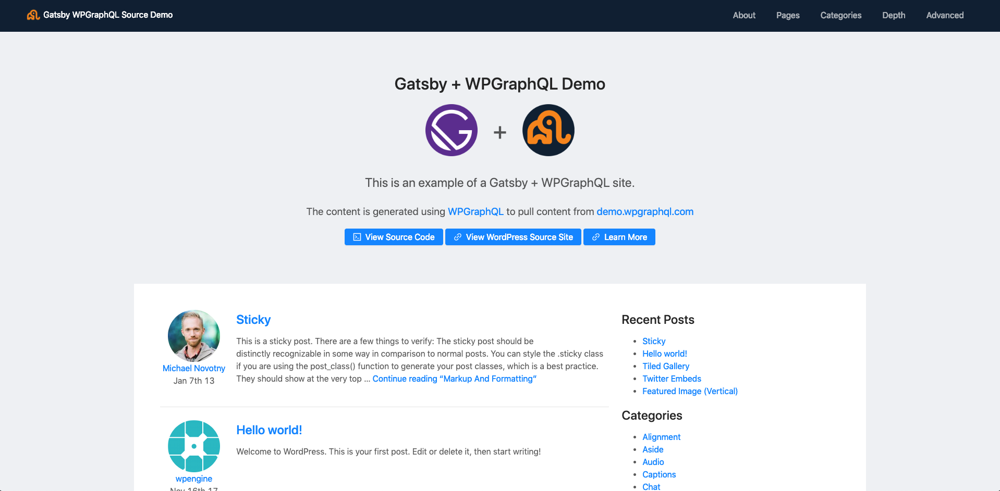

  
  

<h1 align="center">
  Gatsby + WPGraphQL Blog Example
</h1>

This is an example Gatsby site using WPGraphQL as the source. 

## WordCamp Talk
This repo was created specifically for showcasing the capabilities of WPGraphQL and how it can be used in many ways. One particular use is with GatsbyJS. The WordCamp talk this repo was created for can be seen here: https://wordpress.tv/2019/03/08/jason-bahl-building-static-sites-with-wordpress-gatsby-and-wpgraphql/

## Setup

Quick video showing setup of the Gatsby site locally: https://www.youtube.com/watch?v=QkIuuZ5gZNk

## WordPress Source

The WordPress where the content is managed lives here: [https://demo.wpgraphql.com](https://demo.wpgraphql.com)

## Gatsby Site

The Live Gatsby site is at: [https://gatsby-wpgraphql-blog-example.netlify.com/](https://gatsby-wpgraphql-blog-example.netlify.com/)

### Features

Below are features of the Gatsby site that are all sourced via WPGraphQL Queries, so the data is 
managed in WordPress, but is pulled into the Gatsby site and rendered there:

- :white_check_mark: Menus
- :white_check_mark: Pages
- :white_check_mark: Paginated Blogroll/homepage
- :white_check_mark: Single Posts
- :white_check_mark: Authors
- :white_check_mark: Categories
- :white_check_mark: Tags
